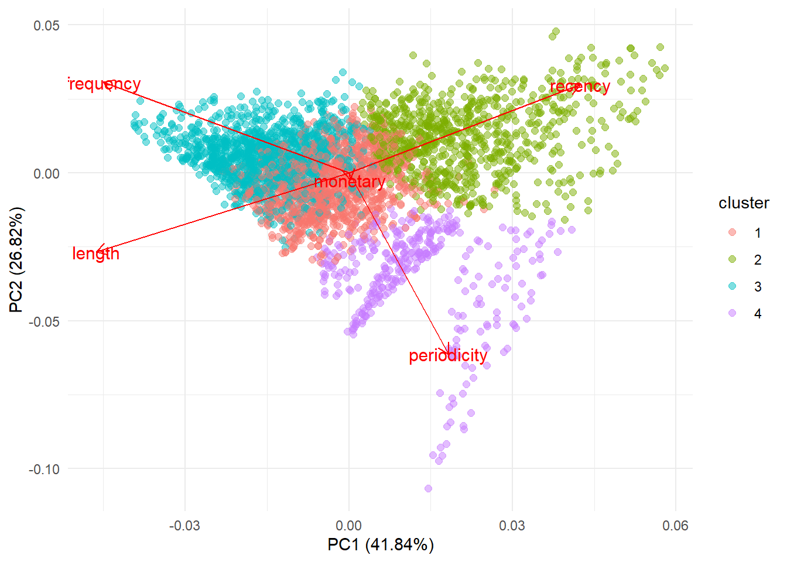

The main purpose of this article is to learn how to identify different customer segments in retail industry using K-Means clustering method. This article is inspired by a publication by [Peker et al.](https://www.emerald.com/insight/content/doi/10.1108/MIP-11-2016-0210/full/html) who proposed an LRFMP (Length, Recency, Frequency, Periodicity) model for classifying customers in the grocery retail industry.

The cluster produced by K-Means can identify 4 different segments of customers based on their LRFMP value:

**Cluster 3: Most Loyal**

Cluster 3 has the highest number of member, with 60% of customers belong to this cluster. They are identified by the high `Frequency` of visit and also the most `Recent` member to visit the store. They are also the most loyal indicated by the `Length` variable. They will on average visit our store once a month based on the `Periodicity` value. We must keep this segment of customers since they are the most valuable.

**Cluster 1: Regular**

Cluster 1 is indicated by their low `Monetary` value compared to other segments. However, they still has high `Frequency` of visit and quite loyal. They wil visit our store every 2 months on average based on the `Periodicity`value.

**Cluster 2: Hibernating**

Cluster 2 is indicated by their `Recency` which shows that their last visit to our store was around 4 months ago. This cluster may require special treatment to prevent them from churning to other competitor. Although they have visited us around 4 times based on their `Frequency`, they are also the least loyal as shown by the value of `Length`.

**Cluster 4: Seasonal**

Cluster 4 has the lowest number of member, with only 10% of customers belong to this cluster. They are identified by the lowest `Frequency` of visit (only 3 times) and on average only visit our store around every 3-4 months based on the `Periodicity` value.
